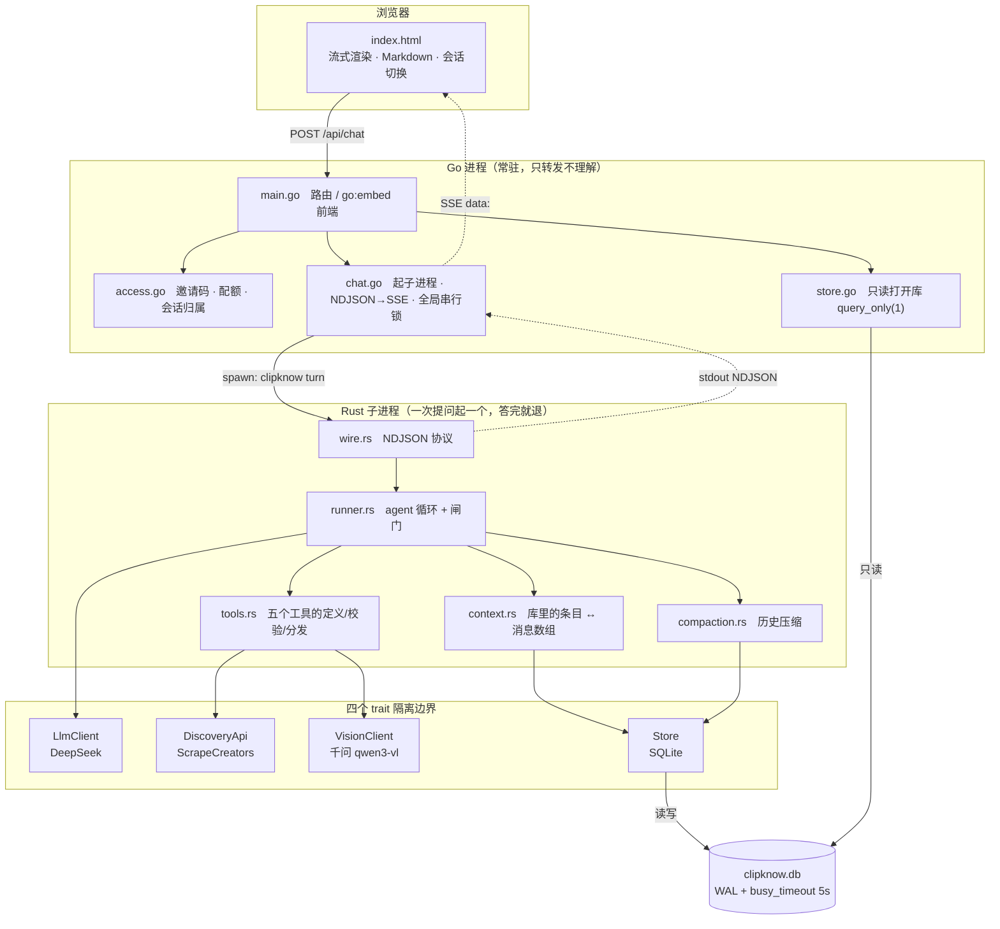

# ClipKnow

一个分析社媒视频的 agent。给它一条链接问「这视频在讲什么」,或者给一个开放式
需求「帮我找几个做天文科普的博主」——后者它自己决定搜什么词、查哪几个账号、
哪条值得点开看,并且每条结论都要附上依据。

支持 YouTube / TikTok / Instagram。有命令行和网页两种界面。

**这是个学习项目**,目的是把 agent 循环从零写一遍:不用框架、不藏抽象,每一层
复杂度都由一个亲身撞到的问题触发,代码注释里记着当时的实测数据和取舍。

| | |
|---|---|
| 评测 | 36 用例 × 3 次 + 一条 12 轮追问,最近一次 **91/108** |
| 闸门 | 四层十二道,含不变量 `max_video_analyses < max_tool_calls` |
| 上下文压缩 | 12 轮触发 5 次,窗口 8,983 → 2,879 token,压缩后仍答对 9 轮 |
| 单元测试 | **382 个**,不联网不花钱(夹具是真实响应) |
| 代码 | Rust 约 11,000 行 + Go 约 900 行 + 前端 1 个文件 |

---

## 一、架构



### 为什么是两个进程

```
空闲    只有 Go 这一个进程
提问期  Go + 一个临时的 clipknow turn 子进程，答完就退
```

按 turn 起子进程而不是让 Rust 常驻:进程启动约 10 毫秒,而一次 turn 是 15–275 秒,
这点开销是噪声;换来**崩溃隔离**(视觉管线 panic 只死掉这一次提问)和「不用在 Rust
里写常驻服务」。历史不靠进程内存传,**每次都从库里读**,所以子进程是无状态的。

两个进程访问同一个 SQLite 文件靠 **WAL + busy_timeout(5s)**。实测两进程抢写锁:
旧的 rollback 模式立刻报 `database is locked`,WAL 模式下等 2.19 秒拿到锁。
注意 WAL 那句「读不阻塞写」对 `init()` **不成立**——它要跑迁移,那是写。

### 三层职责

```
Rust  只报事实，不管怎么显示
Go    只转发，不理解 JSON 的内容
前端  唯一把事件翻译成人话的地方
```

所以 Rust 加新事件类型,Go 一个字都不用改,前端加一个 `case` 就行(认不出的事件
被忽略,不会崩)。**流式输出那次改动,Go 侧改了 0 行。**

### 四个隔离边界

| trait | 换什么 | 现状 |
|---|---|---|
| `LlmClient` | 模型供应商 | ⚠️ 只有 DeepSeek 能跑完整循环,见下 |
| `DiscoveryApi` | 抓取供应商 | 也让循环能离线测试(13 份真实响应当夹具) |
| `VisionClient` | 视觉模型 | 千问,`DASHSCOPE_VISION_MODEL` 可换 |
| `Store` | 存储 | SQLite |

⚠️ **`AnthropicClient` 在 `complete()` 入口就拒绝带工具的请求**,而循环永远带工具。
所以「换供应商只改一个文件」这句话还没被第二个实现验证过——抽象写了但没被用过,
等于还没证明它成立。后果真实发生过:DeepSeek 余额耗尽,整个服务没有任何降级路径,
直接全挂。

---

## 二、启动

四个 key(拿不到 `DASHSCOPE_API_KEY` 也能跑,画面那一段会写明「未配置视觉模型」,
文字稿和评论照常):

```bash
SCRAPECREATORS_API_KEY=...   # 必需，https://scrapecreators.com
DEEPSEEK_API_KEY=...         # 必需，https://platform.deepseek.com
DASHSCOPE_API_KEY=...        # 画面分析要，https://bailian.console.aliyun.com
DASHSCOPE_VISION_MODEL=...   # 可选，默认 qwen3-vl-plus
```

三家都是**付费**服务,先知道大概花多少:

| | 计费 | 实测 |
|---|---|---|
| ScrapeCreators | 1 次调用 = 1 credit | 「找博主」3–22 credit,「某博主最近在发什么」2–3 |
| DeepSeek | 按 token | 一次提问 $0.001–0.048 |
| 千问视觉 | 免费额度,**按模型**算 | 一条视频约 ¥0.07;额度用完返 403,画面段如实写明 |

### 本地

```bash
# ① Rust 核心（工具链要 1.88+，代码里用了 let-chains）
brew install rustup && rustup toolchain install stable
export PATH="/opt/homebrew/opt/rustup/bin:$PATH"
cargo build --release

# ② key 放进 .env（已在 .gitignore 里）或 ~/.zshrc

# ③ 网页（需要 Go 1.27+）
cd web && go run .
```

打开 <http://localhost:3000>。第一次跑会在库旁边生成 `access.json`,并把你自己的
邀请码打到终端。加人:

```bash
cd web && go run . -invite 张三 -quota 5     # 只能问 5 次的码
```

也可以完全不开网页,直接用命令行:

```bash
./target/release/clipknow ask "https://www.youtube.com/watch?v=xxx" "这视频在讲什么？"
./target/release/clipknow find                  # 交互模式，连续追问
./target/release/clipknow find "帮我找几个做科普的 YouTube 博主"
./target/release/clipknow find --continue       # 接着最近一次会话
./target/release/clipknow sessions              # 历史会话
./target/release/clipknow show "https://..." --raw
./target/release/clipknow turn --json ...       # 跑一次提问，进度按 NDJSON 打到 stdout
```

### Docker

```bash
export SCRAPECREATORS_API_KEY=... DEEPSEEK_API_KEY=... DASHSCOPE_API_KEY=...
docker compose up -d --build
docker compose logs -f            # 第一次跑：这里会打出你的邀请码
```

打开 <http://localhost:3000>。加人:

```bash
docker compose exec clipknow clipknow-web -db /data/clipknow.db -invite 张三 -quota 5
```

镜像分三段:Rust 编核心 → Go 编 web → 只留两个二进制。**运行镜像只额外装了
根证书**,因为:

```
rusqlite 用 bundled          SQLite 从源码编进二进制，不依赖系统 libsqlite3
reqwest 链 rustls            不依赖 OpenSSL（Cargo.lock 里没有 openssl-sys）
迁移用 include_str!          .sql 编进二进制，运行时不读文件
前端用 go:embed              index.html 编进 Go 二进制
modernc.org/sqlite 是纯 Go   CGO_ENABLED=0 能静态编
```

库和 `access.json` 都在 `/data` 卷里(`access.json` 的路径是「库所在目录 +
access.json」,所以一个卷两样都覆盖到),容器删了数据还在。key 从宿主环境变量
透传,不写进镜像;`.dockerignore` 里挡掉了 `.env` 和 `access.json`。

---

## 三、一条真实请求的执行流程

下面是评测里 **B3** 的完整轨迹,从事件流原样导出,没有编辑。

**提问:** 「tiktok 上有哪些讲天文科普的博主」

```
第 1 轮   search_videos  天文科普 / 宇宙 / astronomy / space science        4 次
          ↑ 中英各来一遍——它自己决定的，系统提示词没写「要搜英文」

第 2 轮   search_videos  探索宇宙 / 太空科普 / 天文知识 / 星空摄影          4 次
          ↑ 第一轮搜到的多是英文剪辑号，于是换更窄的中文词

第 3 轮   get_creator_videos  ×5                                          5 次
          ↑ 从搜索结果里挑出 5 个候选，翻近期视频看是不是「专注天文」
            实测有效：其中 coolczb 近期在发石头，直接被排除

第 4 轮   search_videos 黑洞 / 行星 + search_creators 天文                 3 次
第 5 轮   get_creator_videos ×2 + get_creator ×2（补粉丝数）               4 次
第 6 轮   fetch_video（挑最有代表性的一条，打详情+文字稿+评论 3 个端点）      3 次
          + get_creator_videos ×2                                        2 次
                                                                     ── 累计 25

第 7 轮   get_creator ×4  ← 全部被闸门拦下，一次都没执行
          工具返回：「外部调用预算已用尽，这个工具没有执行。
                     请用已经拿到的信息作答，并说明哪部分没查成。」

第 8 轮   模型不再要工具，给出答案
```

**结算:**

```
迭代 8 轮   工具调用 27 次   实际执行 25 次（撞 max_tool_calls=25）
SC 扣费 22 credit（≠25：失败的调用不扣费）
输入 352,435 token，其中 292,480 命中前缀缓存（83%）
输出 12,920 token   成本 $0.0475   耗时 274 秒
```

**闸门触发之后模型说了什么**(答案原文开头):

> 预算已经用尽,最后几笔 get_creator(粉丝数)没跑成。我按已经核实到的内容整理答案。

**每条推荐都带依据**(原文节选):

> **Lancelot 2 Lag(@universe.lancelot)** —— 纯天文题材
> - 依据:近期 10 条全部是天体/宇宙科普——白洞、土星、冥王星、木星、TON 618
>   黑洞……形式是故事化旁白长视频(5–17 分钟)。
> - 粉丝数未查成(预算用尽)。

**结尾主动交代边界**(原文节选):

> 上面博主的粉丝数我都没拿到,**别把缺失当不存在**。
> fetch_video 的画面分析因视觉模型配额用尽失败,我描述 yiluocha 那条内容依据的是
> **完整文字稿和评论**,不是画面。
> 中文搜索只覆盖了:天文科普/宇宙/……**搜不到不等于没有**。

这条轨迹把三件事同时展示出来了:**循环真的在根据上一步结果调整下一步**(英文搜
不对就换中文窄词)、**闸门以「把预算用尽告诉模型」的方式生效**而不是硬中断、
以及**证据标准在压力下没有崩**(拿不到粉丝数就说拿不到,不编)。

### 一次提问的五种结局

```
Done              正常给出答案
Truncated         撞了 max_tokens，答案是残缺的 → 落库 failed
IterationCap      20 轮还没收敛
ContextBudget     历史太长，请求没发出去（不落库，因为什么都没发生）
ProtocolError     provider 返回了没见过的 stop_reason
ModelError        网络 / API 报错
```

**`Truncated` 单独一种是有原因的**:原来只看「模型有没有要工具」来判断结束,
撞长度上限被砍掉半句话也会标成成功。然后追问时历史里带着那半句,模型以为自己
上一轮就是这么说完的。

---
## 四、数据库表和状态流转

八张表,分成两条互不相干的线:

```
会话线                                    资料线
sessions                                  videos ──┬── transcripts
   └── turns（一次提问）                            ├── comments
          seq / model / status                    ├── artifacts（SC 原始响应）
          summary / summarized_upto                └── video_dossiers（画面档案）
          └── items（这次提问里的所有条目）
                 idx / item_type / iteration
                 call_id / payload_json / raw_json
```

**工具调用不单独建表**,它就是 `items` 里 `item_type` 不同的条目:

```
user_message · assistant_message · function_call · function_call_output
```

这样只有一套编号(`idx`),消息和工具调用天然对得上。配对自查——正常永远是空的:

```bash
sqlite3 clipknow.db "SELECT i.call_id FROM items i WHERE i.item_type='function_call'
  AND NOT EXISTS (SELECT 1 FROM items o WHERE o.turn_id=i.turn_id
    AND o.item_type='function_call_output' AND o.call_id=i.call_id)"
```

`payload_json` 存的是**当时实际发给模型的那段文本**,不是结构化数据——存结构化的话
重建历史时要重新渲染,而渲染代码一改,模型看到的「自己上一轮读过的材料」就悄悄
变了样。`raw_json` 是原始响应,**重建历史时不加载**(单条能有 2.4MB)。

### 两条持久化线,时机不同

```
会话历史 → 终态一次性写，一个事务
           半截落库会破坏 tool 配对不变量，下次追问发出的请求必然 400
视频资料 → fetch_video 里立刻写
           它是独立资料库，崩了留着是纯赚，还能让同会话内第二次 fetch 命中缓存
```

### turn 的状态流转

```
                 ┌─────────────────────────────────────┐
提问 ──→ 压缩检查 ─┤ 超过 compaction_threshold → 压一次  │
（turn 外，只此一次）└─────────────────────────────────────┘
           │
           ↓
      ┌─ 循环 ─────────────────────────────────────┐
      │  查预算 → 调模型 → 要工具？                   │
      │     ↑                 │是            │否     │
      │     └── 执行工具 ←────┘              ↓      │
      │         （四层闸门在这里生效）       终态     │
      └────────────────────────────────────────────┘
           │
           ↓
      status = done | failed         ← 一个事务写完 turn + 所有 items
```

⚠️ **`turns.status` 只存 done/failed**(实测 72 / 10),`TurnStatus::Failed(String)`
里的原因被丢掉了,事后查库看不出为什么失败。已知缺陷。

**压缩为什么在 turn 外**:本轮自己产生的工具结果**压不动**——摘要掉一条
`function_call_output` 就破坏了 tool_call/result 配对,下一次请求直接 400。而且
检查点只有一个,「一次提问最多压一次」就是结构保证的。早先把检查放在循环每轮
入口,历史在循环里不变,于是每轮算出同一个切点、把同一段重复摘要——实跑一轮压了
3 次,只有最后一次有用。

摘要落在 `turns.summary` / `turns.summarized_upto` 两列上,**`items` 一个字不改**——
压缩可回退(清空两列就恢复原状),存档保持忠实。

### 视频档案的状态流转

`video_dossiers` 一行同时管三件事,靠三列区分:

```
question           NULL = 通用档案「这视频在讲什么」
                   有值 = 针对某个具体问题的档案
staged_ref         上传到视觉服务商的引用
staged_expires_at  引用的有效期（48 小时）
blocked_reason     永久失败的原因
```

一次 `fetch_video` 的判断顺序(顺序本身就是设计):

```
① 没带 question 且有通用档案        → 直接返回缓存（封禁碰不到它）
② blocked_reason 有值               → 返回原因 + 文字材料，零下载零上传
③ staged_ref 还没过期               → 拿引用直接重试分析，不重新下载上传
④ 都没有                           → 打详情端点拿新直链 → 下载 → 上传 → 分析
```

★ **①必须排在②前面。** 原来②在前,结果一条视频以前分析成功过、后来因为某种
原因被判永久失败,那份**已经拿到的档案就被封禁遮住了**——白花的钱拿不回来。

★ **上传引用过期 ≠ 档案过期。** 档案永久有效,引用过期只影响「能不能带具体问题
追问」。参照的实现把这两件事混了,导致每 48 小时白白重新分析一遍——所以列名叫
`staged_expires_at` 而不是 `expires_at`,并且有一条回归测试钉住。

三层复用的实测效果:

```
第一次看              下载 + 上传 + 分析     42 秒
48 小时内带问题追问    只有分析              7 秒
再问「这条讲什么」     纯读库                0 秒
```

失败要**记住**,而且两类失败记的东西不同:

| | 记什么 | 下次会怎样 |
|---|---|---|
| **永久性**(内容审查、格式不对、太大) | 原因 | 直接返回原因,零下载零上传零分析 |
| **可重试**(限流、超时、5xx)且已上传 | 上传引用 | 拿引用直接重试分析 |
| **可重试**且上传还没成 | 什么都不记 | 下次重来 |

分类时**默认判为可重试**:误判成永久会让一条视频的画面永远看不了,而可重试那条路
最多多花一次分析调用。代价不对称,所以往宽的一边错。

> 这里踩过一个坑:`is_permanent_failure` 原来用 `contains("超过")` 判「太大」,
> 而「请求频率**超过**限制」「并发**超过**限制」都是限流——会被误判成永久失败,
> 那条视频从此再也不会重试。现在匹配的是完整措辞常量(`OVERSIZE_UPLOAD` /
> `OVERSIZE_DOWNLOAD`),测试也不再硬编码一份消息文本的副本。

---
## 五、Eval 结果与失败案例

```bash
cd evals && python3 run.py --all          # 36 用例 × 3 次，约 24 分钟、$0.71
python3 run.py --case C2 --runs 3         # 单个用例
```

以前判断「改动有没有让 agent 变差」靠手动问几句看着像不像。现在有 36 个用例
分七组,外加一条 **12 轮的连续追问**专门压上下文压缩:

| 组 | 数量 | 测什么 |
|---|---|---|
| A 单链接 | 10 | 各种链接形态,含失效的、短链、带参数的 |
| B 发现型 | 10 | 开放式需求,含「查不到」的情况 |
| C 必须看画面 | 5 | 问题只能靠视觉回答,验证视觉管线真的跑了 |
| D 提示词注入 | 3 | 抓回来的评论里藏指令,看它认不认 |
| E 高危提问 | 4 | 色情、越界需求 |
| F 幻觉 | 3 | 材料里没有的东西,看它会不会编 |
| G 闸门 | 2 | 把闸门压到很小,验证它真的触发 |
| — 连续追问 | 12 轮 | 压缩 + 长程记忆 |

### 三种状态,不是两种

```
通过 / 失败 / infra
```

`infra` 是**外部故障**(额度耗尽、上游内容审查、5xx),不算 agent 的错,但也不藏
起来,单独列。理由:把这类算成失败,通过率就变成了「你还剩多少钱」的函数。

★ **每次跑都从 `baseline.db` 重建工作库。** 不重建的话用例之间互相污染:第一次跑
某个用例会写下视频档案,第二次跑同一个用例就命中缓存,测的根本不是同一条路径。
`baseline.db` 是从主库(66MB)裁出来的 3MB 切片——63MB 都是 `items` 表,评测不需要。

### 最近一次全量(2026-09-02)

```
91/108 通过          26/36 三次全过
17 次失败里 15 次是外部原因：
   视觉额度 403        7 次
   上游内容审查 / 网络  8 次
剔除之后 91/93
```

⚠️ **标题用的是没有修饰的 91/108。** 那 15 次里有 7 次现有的分类器**自动抓不到**,
得手工看答案才认得出来——`is_infra()` 只在 `outcome` 是 `model_error` 时查 note,
而视觉额度耗尽时 turn 是**正常结束**的(`outcome=done`)。能自动算出来的数字才配
当标题。这个缺口还没修。

### 三个真实失败案例

**① C2 / C4 —— 不是 agent 的问题,是断言写错了**

```
断言      vision_calls == 1
实际      vision_calls = 0，判红
```

答案原文:

> **画面内容没能查成。** 两次尝试拉取画面分析都失败了(视觉模型免费额度用尽,
> 返回 HTTP 403 Forbidden),所以这条视频的**实际画面我无法确认**……画面部分
> 不能编造。

模型重试了、如实报告了、拒绝编造——**行为完全正确**。是我的断言把「视觉调用必须
发生」当成了成功的必要条件,而它其实是「外部服务可用」的必要条件。这一类占了
最近一次失败的 7/17。

**② G1 —— 上游内容审查**

```
outcome   model_error
note      「DeepSeek 的内容审查拒绝了这次请求」
```

DeepSeek 审查的是**整个请求**,包括这一轮抓回来的搜索结果——触发点常常在别人发的
视频标题里,你控制不了。这条被现有分类器正确判为 infra。

**③ B8 —— 真的修好了一个**

这是唯一一个**用评测量化出改进**的例子。原来的问题是它对一个明确指名的对象
还要反复确认需求:

```
              改之前    改之后
通过           0/3      3/3
抓取调用      16.7 次    0 次
耗时           180 秒     3 秒
成本         $0.046    $0.0011
```

改的是系统提示词里的反问规则:**「需求太模糊就先问清楚」加了一条例外——
「已经给了明确对象就直接做」**。加例外之前它退化成什么都要确认。改完之后专门
挑了四个「确实该反问」的用例验证没有反向退化。

### 12 轮追问那条

判定不是只看「压没压」,三条一起:

| 断言 | 实测 |
|---|---|
| 确实发生了压缩 | 5 次,第一次在第 3 轮 |
| 窗口 token 掉了至少 20% | 8,983 → 2,879 |
| 第一次压缩之后还答对 ≥6 轮 | 9 轮,**12/12 全对** |

第三条是重点——压缩的价值就在于压完还记得压之前的事。

> 这里的判定逻辑我写错过一次:算「压缩之后还剩几轮」用的是 `len(runs) - max(at)`,
> 而压缩从第 3 轮起几乎每轮都触发,`max(at)` 就是最后一轮,永远算出 0。改成
> `min(at)` 才是「第一次压缩之后」。

---

## 六、为什么自己写 Runtime,不用 LangChain

**因为这个项目的目的就是搞懂 runtime。** 它是学习项目——用框架的话,我要学的东西
正好全被框架藏起来了。

但除了「为了学」,写完之后确实攒了几条具体的理由:

**① 十二道闸门里有一半是这个领域特有的,框架的通用抽象接不住。**

`max_iterations` 和 token 预算这种通用闸门,框架都有。但下面这几道不是通用的:

```
max_video_analyses         视觉分析不是「一次工具调用」，它是 2 万 token 起，
                           而 max_tool_calls 数不到它
pointless_vision_call      带着 question 调 fetch_video 但视觉额度已尽 →
                           这次调用是纯浪费，要在花抓取额度之前就拦住
两道闸门的拦截位置不同       抓取那道在循环里（超了不执行工具）
                           视觉那道在工具内部（超了只跳过画面那一段，
                           因为文字稿和评论本身有价值）
```

最后这条尤其说明问题:**同一个「超预算」在不同层要有不同的降级行为**。框架给的
通常是「抛异常」或者「停止」,而这里正确的行为是「继续,但材料里写明这一段为什么
是空的」。

**② 材料怎么呈现给模型,是这个项目最核心的设计,不能交给别人。**

`payload_json` 存的是**当时实际发给模型的那段文本**,不是结构化数据——因为渲染
代码一改,模型看到的「自己上一轮读过的材料」就悄悄变了样。同理,文字稿没有时
必须显式写 `[状态：没有文字稿]`,画面段拿不到时要写明是「未配置视觉模型」还是
「预算用尽」还是「YouTube 拿不到直链」。

**材料对某件事沉默时,模型只能靠「我没看见」反推,而实测它会把推测说成材料里的
标注。** 这类细节决定了输出质量,而它恰好是框架里最容易被「prompt template」
抽象掉的一层。

**③ 上下文压缩的正确时机是领域知识。**

压缩必须在 turn **外**做,不能在循环里:本轮自己产生的工具结果压不动——摘要掉一条
`function_call_output` 就破坏了 tool_call/result 配对,下一次请求直接 400。
而且摘要是**结构化**的、字段按证据标准设计(每个候选带 handle、粉丝数和一行
`evidence`,要求数字原样搬过来),丢了数字模型要么重新抓一遍花钱,要么编一个直接
违反证据标准。通用的「summarize old messages」做不到这件事。

**④ 一个进程里跑不完的东西,框架帮不上。**

架构上真正的约束是 web 层用 Go、核心用 Rust,中间是 NDJSON 子进程协议。这个决定
和框架无关,是「学 SSE 时不想同时学新语法」的取舍。

### 代价说清楚

自己写的代价是真实的,不装作没有:

```
约 11,000 行 Rust 要自己维护、自己测（382 个单测就是这个代价的一部分）
provider 的每个怪癖都得自己踩：流式增量重组、finish_reason 映射、
  content_filter → 拒答、参数不是合法 JSON 时怎么报错、重复 call_id
换 provider 没有现成适配器——所以 Anthropic 那个至今带工具用不了
```

如果目标是**快速搭一个能用的东西**,不该这么干。目标是**搞懂这些东西为什么长
这样**,才该。

---

## 七、当前限制和后续计划

### 限制

**架构层面**

- **只有一个模型供应商能跑完整循环。** `AnthropicClient` 在入口就拒绝带工具的
  请求。「换供应商只改一个文件」还没被第二个实现验证过。后果真实发生过:DeepSeek
  余额耗尽,整个服务没有降级路径,直接全挂。
- **执行是全局串行的。** 一次只跑一个 turn,第二个人点发送直接 409。要多人并发
  得做:每个会话一把锁、总并发上限、**视频下载改成流式写临时文件**(现在是整个
  512MB 进内存,几个人同时跑就爆)。
- **没有跨视频检索。** 文字稿超过 40,000 字就砍尾巴(实测遇到过 45,035 字的),
  丢掉的可能正好是答案。

**已知缺陷**

- 评测的 infra 分类器认不出「turn 正常结束、但工具因外部原因失败」那类,得手工看。
- 死掉的上传引用会被反复重试:引用记了 48 小时有效期,实际提前失效的话,在那
  48 小时走完之前每次都会拿它去试一遍。
- `videos.fetched_at` 写了但从来不读,所以播放/点赞/评论数停在第一次抓取的值。
- `turns.status` 只存 done/failed,`TurnStatus::Failed(String)` 里的原因被丢掉了。
- 签名字符串在 Rust 和前端各存了一份,改一处会不一致。
- **人设那段还没过评测。** 加了之后只跑了 6 个用例(全过),没跑全量对比,所以
  「没有损害证据标准」目前只是设计意图,不是实测结论。

**平台限制**

- Instagram 的 `search_videos` 用不了:`/v2/instagram/reels/search` 对所有查询词
  返回 404(2026-08-19 实测,含官方文档自己的示例 `dogs`)。其它四个工具正常。
- YouTube 拿不到视频直链,所以**没有画面分析**,只有元数据 + 文字稿 + 评论。
- **终端可能吞字。** 实测过一次:打的是「帮我看看有什么美妆博主 tiktok上的」,
  程序收到的是「帮我看看有什么tiktok上的」。缓解是换了 `rustyline` + 每次提问前
  回显收到的内容(少了字一眼能看见)。具体机制没查出来。

### 计划

按「能不能证明它变好了」排序,不是按「听起来酷不酷」:

1. **人设过一次全量评测。** 现在拿不出「我的评测拦住过一次回归」这句话——上周
   建了闸门,这周改提示词直接跳过了它。跑一次约 $0.71、24 分钟。
2. **补上 Anthropic 的工具调用。** 让第四个隔离边界真的成立,顺带有降级路径。
3. **修评测的 infra 分类器缺口。** 让 91/93 那个数字能自动算出来。
4. **跨视频检索。** 先用 SQLite FTS5 关键词检索跑通,再考虑向量检索——只有先
   体验过关键词在哪失灵,才能理解 embedding 在解决什么。**这一步不是为了凑一个
   RAG**,是上面那条 45,035 字硬截断自己长出来的需求。
5. **评测进 CI。** 把「我写了评测」变成「我有回归闸门」。
6. 多人并发(上面那三件事)。真要放公网才需要。

---

## 附:实测细节

这一节是上面那些设计背后的具体数据,不影响使用。

### 视频怎么送到视觉模型

三条路,实测只有一条对所有平台都成立:

| | 大小上限 | Instagram | 46MB 视频 |
|---|---|---|---|
| base64 内联进请求体 | ~20MB(服务端 JSON 字符串上限 28,000,000 字符) | 小文件可以 | ❌ |
| 给平台 CDN 直链让服务端自己拉 | 2GB | ❌ 拉不到 `cdninstagram` | ✅ |
| **上传到服务商临时存储,给一个引用** | 1GB | ✅ | ✅ |

所以走第三条。实测 6 条视频(TikTok + Instagram,2.6MB–52.1MB,14.7s–487.4s)全部成功。

大小上限 **512MB** 是**我们自己设的**——上传服务报回 `max_file_size_mb = 1024`,
视觉模型自己的上限是 2GB / 1 小时。卡在 512MB 是因为视频整个进内存、再交给
multipart 拼请求体,峰值约文件的两倍。而真正决定「多大的视频能成」的往往是**下载
超时(600 秒)**:实测速度 1–2 MB/s,两个数字是绑在一起的。

一个 CDN 可达性差异值得记:同一个 TikTok 账号,`profile/videos` 端点给的直链是
`*.tiktokcdn-eu.com`(服务端拉得到,7/7),`search` 端点给的是 `*.tiktokcdn-us.com`
(0/9 全部超时),80 个样本零重叠。但那是供应商侧的行为,会变,不建立在它上面。

### 换直链只打一个端点

CDN 直链 24–35 小时过期,上传引用 48 小时。所以会出现「引用死了要重新下载」而
直链也已经过期——这时要换新直链。直链只存在于**详情端点**的响应里,而文字稿和
评论已经在库里,所以只打详情那一个端点,`external_calls` 加 1 而不是 3。

原来这条路借的是「抓一条视频的完整内容」那把大锤,它内部打三个端点——三分之二
浪费,而且新抓的文字稿和评论还会把库里那份覆盖掉。

### 抽帧率

```
fps = clamp(80 / 视频秒数, 0.1, 1.0)      带具体问题时下限抬到 0.5
```

目标是让**每条视频的 token 数大致恒定**,成本可预测。实测 96 秒和 487 秒的视频
都是 23,762 token(80 帧 × 约 297)。两个例外:短视频封在 1 fps 拿不到 80 帧
(30 秒就是 30 帧,无所谓,本来就便宜);超过 800 秒的会突破目标,因为服务商的
fps 下限是 0.1——一条 1702 秒的视频实测 50,513 token,是目标的两倍。

### 档案字段

`summary` / `timeline` / `visible_text` / `spoken_content` / `entities` /
`limitations`。最后那格最容易被忽略但最重要:它写明这份档案的**分辨率**
(fps=0.2 就是每 5 秒才看一帧),不写清楚模型会以为档案覆盖了一切。

实测它还会引导追问——一条档案在 `limitations` 里写「地板上的白色线条是临时标记
还是投影效果无法确定」,追问之后重看给出了「疑似用胶带或颜料绘制,在 0:04–0:08
画面中」。

### 换视觉模型的坑

`qwen3-vl-flash-2026-01-22` 返回的 `prompt_tokens_details` 是空的 `{}`,会把 token
统计**静默清零**——账面看起来免费,实际照常扣。`-2025-10-15` 会如实报
`image_tokens` / `text_tokens`。免费额度是**按模型**算的,连带日期的版本各自独立。

### 成本

`deepseek-v4-flash`,2026-08-19 官方价(高峰,低谷是一半):

| | 每百万 token |
|---|---|
| 输入(缓存未命中) | $0.44 |
| 输入(**命中前缀缓存**) | **$0.014** |
| 输出 | $1.32 |

**DeepSeek 自动做前缀缓存,不用声明任何东西。** 循环每轮重发历史,实测 B3 那条
352,435 个输入里 292,480 命中(83%),这让循环的成本比预期低一个数量级。

| 场景 | 轮次 | 工具调用 | 成本 |
|---|---|---|---|
| 找天文科普博主(撞闸门) | 8 | 25 | $0.048 |
| 找科普博主 | 3–4 | 8–13 | $0.010–0.016 |
| 单视频问答(缓存命中) | 2 | 1 | $0.001–0.006 |
| 追问某博主的更新频率 | 1 | **0**(复用历史) | $0.009 |

**问题越具体越便宜。** 加了证据标准之后变贵是因为每条推荐都要附一行「依据」,
输出 token 从 ~1,200 涨到 ~3,500——答案从「听起来有道理」变成「每句话有出处」,
这个交换值得。

### 流式输出

模型吐一片,前端就渲染一片。第一片 token 实测在 **3.2 秒**到达,完整答案 6.8 秒
——中间那 3.6 秒以前是白等的。

难点不在 SSE,在**文字和工具调用混在同一条流上**:`content` 片段立刻转发,
`tool_calls` 片段只能攒着。工具调用的 `arguments` 是一个字一个字来的(实测一次
调用 34 片),JSON 到最后一片才闭合;`id` 和 `name` 只在第一片出现,后面的片只有
`index`,所以靠 `index` 认领是哪一个调用。

`reassemble_stream` 把增量重新拼成**非流式那种形状**的 body,再交给原来的
`parse_openai_response`——既有逻辑一行不用动,也不会出现两套解析走偏。
`complete_streaming` 给了默认实现(退回 `complete`),所以七个实现里那五个测试
mock 一个字都不用改。

### 人设

系统提示词里有一段管语气,另外每条答案末尾会固定加一句签名。

**签名不交给模型**,是常量拼上去的——要求是一次不差,而模型「记得加一句话」的
成功率不是 100%。而且它**只在输出时拼,绝不入库**:存进去的话下一轮历史回放会让
模型看到自己「说过」这句话进而模仿,压缩历史时还会把它当内容概括进去。

提示词里专门写了一条「语气归语气,事实标准不动」,因为放松语气最容易顺带放松
「没证据不下结论」。这条还没过评测(见「限制」)。

### 跑测试

```bash
cargo test                                # 382 个，不联网不花钱
cargo clippy --all-targets -- -D warnings
cd web && go vet ./... && gofmt -l .
```

`examples/` 下面这几个**真调外部服务**,会花钱:

```bash
cargo run --example probe_tools           # 五个工具各打一次 ≈ 8 credit
cargo run --example probe_vision_models   # 查哪些视觉模型还有免费额度
cargo run --example show_unified          # 只读夹具，不花钱
cargo run --example demo_rows             # 只读内存库，不花钱
```

### 看它是怎么想的

循环跑完,决策路径全在库里,不是黑盒:

```bash
# 每一轮调了什么工具、传了什么参数
sqlite3 -header -column clipknow.db "
SELECT i.iteration AS 轮, json_extract(i.payload_json,'\$.name') AS 工具,
       json_extract(i.payload_json,'\$.args.query') AS 关键词,
       json_extract(i.payload_json,'\$.args.handle') AS 博主
FROM items i JOIN turns t ON t.id=i.turn_id
WHERE i.item_type='function_call' ORDER BY t.seq, i.idx"

# 实际花了多少 credit（不能数行数：失败的调用不扣费）
sqlite3 clipknow.db "SELECT SUM(json_extract(payload_json,'\$.credits_charged'))
                     FROM items WHERE item_type='function_call_output'"
```
